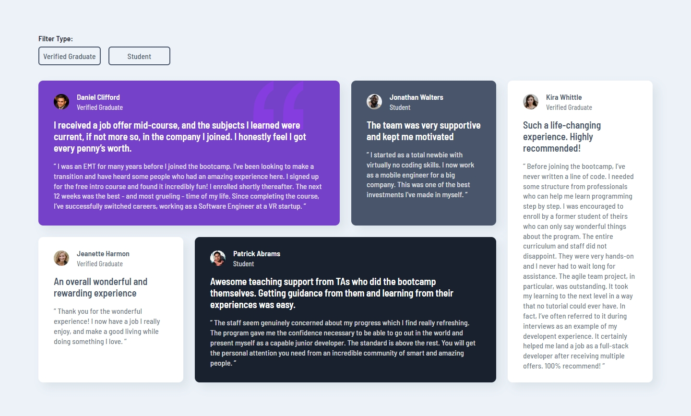

## Frontend Mentor Challenge 19 - Testimonials Grid Section

This is my solution to the [Testimonials Grid Section](https://www.frontendmentor.io/challenges/testimonials-grid-section-Nnw6J7Un7) challenge on [Frontend Mentor](https://www.frontendmentor.io/).

#

### Links. 🔗

- Live Site URL: https://testimonials-grid-section-darkstarxdd.vercel.app/

#

### Screenshots of the Solution (Desktop & Mobile). 🔍

#

### Built with. 🔨

- React.
- Vanilla CSS.
- Framer Motion.
- Vite.

#

### Notes. 📌

- The font sizes in the design file were going as low as 11px and 13px, which I think is too small. Instead I used 14px and 16px, making the text easier for users to read. Because of that, my solution is bit larger than the original design, but I think it's better than forcing the user to read very small text.
- I also used a background blend mode on the background image of the first testimonial, so that it’s more subtle and doesn’t interfere with the text that is in front of it.

#

### Features. ✨

- Added some view based animations using Framer Motion.
- Used the `useReducedMotion` hook to make sure that users who have reduced motion setting enabled don't see the animations, providing a smoother experience for them.

#

### New Things Learned. 🎓

- Using the Framer Motion Library.

#

### Testing and Accessibility. 🧪

- Used the Responsively App to check the site's appearance on various screen sizes, from 320x480 to 3000x2000.
- Set the browser font size on desktop to various values ranging from 9px to 72px to ensure everything on the site scales properly with the user's preferred browser font size.
- Zoomed the page in and out using Ctrl + Scroll wheel (up to 500%).
- Tested with the NVDA screen reader.
- Viewed the site on an iPhone 11 in both portrait and landscape modes.
- Performed Lighthouse and PageSpeed tests. ([PageSpeed Result.](https://pagespeed.web.dev/analysis/https-testimonials-grid-section-darkstarxdd-vercel-app/v0oap08hqr?form_factor=mobile))

#

### Tools I Use. 🔧

- [Prettier VS Code Extension](https://marketplace.visualstudio.com/items?itemName=esbenp.prettier-vscode) - Code formatter.

- [Responsively.app](https://responsively.app/) - A free and open source tool that allows you to test your webpage on different screen sizes, take screenshots and much more.

- [Color Contrast Checker by coolors.co](https://coolors.co/contrast-checker/112a46-acc8e5) - Check color contrast ratios and if needed, update the colors to match the WCAG guidelines.

- [Google Webfonts Helper by Mario Ranftl](https://gwfh.mranftl.com/fonts) - Provides WOFF2 format for Google Fonts.

#

- My Frontend Mentor Profile - [@DarkstarXDD](https://www.frontendmentor.io/profile/DarkstarXDD)
